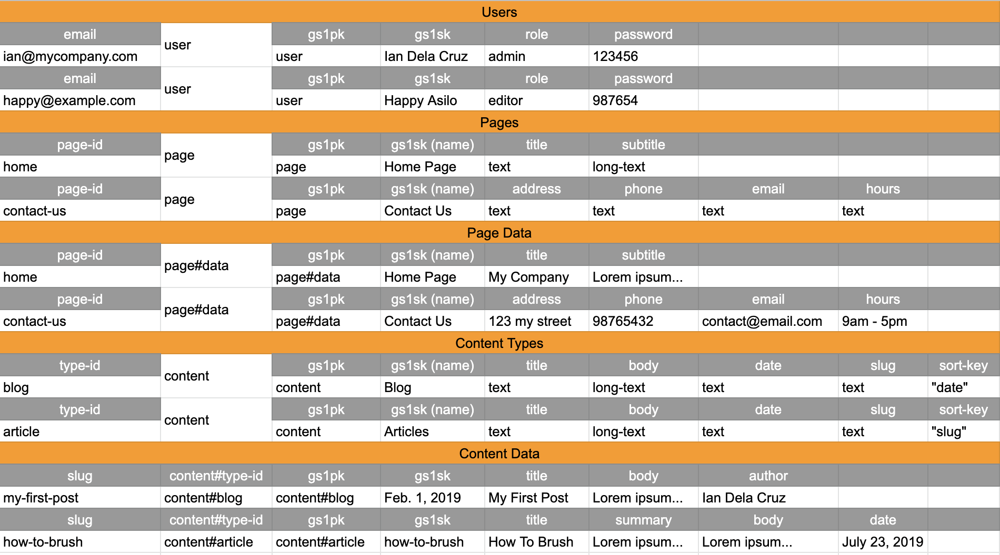

# KDC CMS

A simple headless CMS for AWS serverless infrastructure.

## Reason

* Cheapest way to run headless CMS
* Boilerplate CMS for new projects
* Learn something new - [jwt](https://jwt.io/) and [DynamoDB single table design](https://youtu.be/HaEPXoXVf2k?t=2844).

## Infrastructure

API Server --> API Gateway --> Lambda --> DynamoDB
Web Server --> S3 --> Cloudfront

## DB Design

### Access Patters

* Users
  * List sorted by name (/api/users)
    * gs1pk: "user"
  * Login, update, get user (/api/users/:email):
    * pk: "email"
    * sk: "user"
* Page Definition
  * List sorted by name (/api/page-definition)
    * gs1pk: "page"
  * Get or update page (/api/page-definition/:id)
    * pk: ":page-id"
    * sk: "page"
* Page Data
  * List sorted by name (/api/pages)
    * gs1pk: "page#data"
  * Get or update page data (/api/pages/:id)
    * pk: ":id"
    * sk: "page#data"
* Content Definition
  * List sorted by name (/api/content-definition)
    * gs1pk: "content"
  * Get or update content type: (/api/content-definition/:type)
    * pk: ":type"
    * sk: "content"
* Content Data
  * List sorted as defined by sort-key attribute (/api/contents/:type)
    * gs1pk: "content#:type"
  * Get or update content data (/api/contents/:type/:slug)
    * pk: ":slug"
    * sk: "content#:type"

*Note that **slug** and **sort-key** are mandatory in Content Types.*
